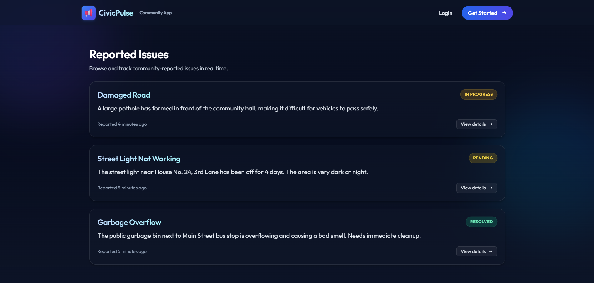
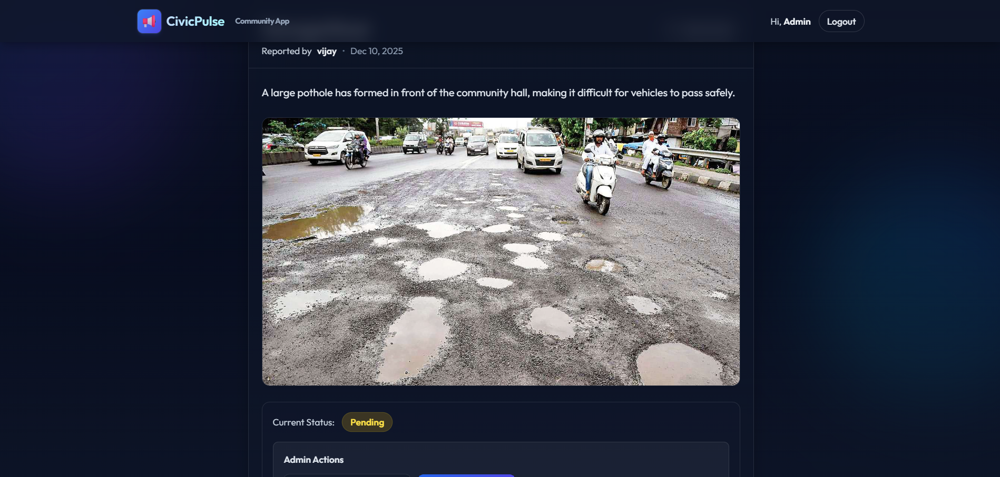
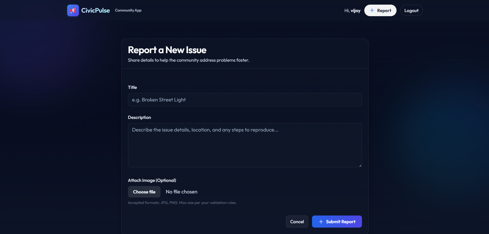
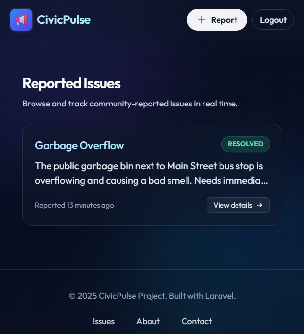

# 📢 CivicPulse — Community Issue Tracker

CivicPulse is a full‑stack web application that connects citizens with local authorities to streamline reporting and resolution of infrastructure issues (potholes, broken streetlights, etc.). Citizens can submit reports with images, while administrators manage statuses and track progress.

<p align="center">
  
</p>

<p align="center">
  <a href="#-features">Features</a> •
  <a href="#-tech-stack">Tech Stack</a> •
  <a href="#-screenshots">Screenshots</a> •
  <a href="#-installation-guide">Installation</a> •
  <a href="#-admin-setup">Admin Setup</a> •
  <a href="#-roadmap">Roadmap</a> •
  <a href="#-contributing">Contributing</a> •
  <a href="#-license">License</a>
</p>

---

## ✨ Highlights

- Modern dark UI with glassmorphism and motion‑safe animations
- Clear separation of Citizen vs Admin capabilities
- Secure authentication, CSRF protection, and route model binding
- Image uploads with storage symlink support
- Accessible forms with validation messaging

---

## 🚀 Features

### 👤 Citizen
- Authentication: Secure login and registration
- Create Reports: Title, description, and image upload
- Dashboard: Responsive grid of community issues
- Ownership: Edit/Delete only your own reports
- Feedback: Animated success toasts and validation errors

### 🛡️ Admin
- Status Management: Update issue status (`Pending` → `In Progress` → `Resolved`)
- Admin‑only Controls: Visible only to authorized users
- Dashboard Overview: View all issues; filters (planned)

---

## 🛠️ Tech Stack

- Framework: Laravel (PHP 8.2+)
- Frontend: Blade, Tailwind CSS (CDN), Alpine.js
- Database: MySQL
- Architecture: MVC
- Security: CSRF, Policies/Gates, Route Model Binding

---

## 📸 Screenshots

| Dashboard (Grid) | Issue Details (Admin) |
| :---: | :---: |
|  |  |

| Create Report | Mobile Responsive |
| :---: | :---: |
|  |  |

> Tip: Replace these placeholders with your real screenshots under `screenshots/`.

---

## ⚙️ Installation Guide

### 1) Clone the Repository
```bash
git clone https://github.com/yourusername/civic-pulse.git
cd civic-pulse
```

### 2) Install Dependencies
```bash
composer install
```

### 3) Environment Setup
```bash
cp .env.example .env
php artisan key:generate
```

Update `.env` with your database credentials:
```env
DB_CONNECTION=mysql
DB_HOST=127.0.0.1
DB_PORT=3306
DB_DATABASE=civic_pulse
DB_USERNAME=root
DB_PASSWORD=
```

### 4) Create Database
- Create a database named `civic_pulse` (phpMyAdmin/MySQL Workbench/etc.)

### 5) Run Migrations
```bash
php artisan migrate
```

### 6) Link Storage (for images)
```bash
php artisan storage:link
```

### 7) Run the Application
```bash
php artisan serve
```
Visit http://127.0.0.1:8000

---

## 🔑 Admin Setup

By default, all registrations are Citizen users. To promote an account to Admin:

```bash
php artisan tinker
```

```php
$user = App\Models\User::where('email', 'admin@example.com')->first();
$user->is_admin = true;
$user->save();
exit
```

Log out and log back in to see Admin controls.

---

## 📦 Project Structure (Key Views)

- `resources/views/layouts/app.blade.php` — Base layout (navbar, theming, animations)
- `resources/views/issues/index.blade.php` — Issues listing (grid/cards)
- `resources/views/issues/show.blade.php` — Issue details + admin actions
- `resources/views/issues/create.blade.php` — Create report form
- `resources/views/issues/edit.blade.php` — Edit report form
- `resources/views/auth/login.blade.php` — Login
- `resources/views/auth/register.blade.php` — Register

---

## 🧪 Feature Demo (GIFs recommended)

- Submit a new report (title, description, image)
- Admin updates status in detail view
- Edit/Delete actions visible only to the owner
- Success toast and validation messages upon actions

---

## 🗺️ Roadmap

- Status filters and search on dashboard
- Role management UI
- Commenting on issues
- Email notifications for status changes
- Basic analytics for authorities

---

## 🧰 Developer Notes

- Tailwind is loaded via CDN; you can switch to a build pipeline for production
- Global font can be configured via Tailwind CDN config (e.g., Google Fonts “Outfit”)
- Animations respect `prefers-reduced-motion`

---

## 🤝 Contributing

Contributions are welcome!
1. Fork the repository
2. Create a feature branch
3. Commit changes with clear messages
4. Open a Pull Request

Please include screenshots or GIFs for UI changes.

---

## 📄 License

MIT License. See `LICENSE` for details.

---

## ✅ Next Steps (Job‑Ready Checklist)

1. Initialize Git:
   ```bash
   git init
   ```
2. Ignore local storage uploads:
   ```gitignore
   /public/storage
   ```
3. Create a GitHub repository and push:
   ```bash
   git remote add origin https://github.com/yourusername/civic-pulse.git
   git add .
   git commit -m "Initial commit: CivicPulse"
   git push -u origin main
   ```

You’ve built something impactful—good luck with the job hunt! 🚀